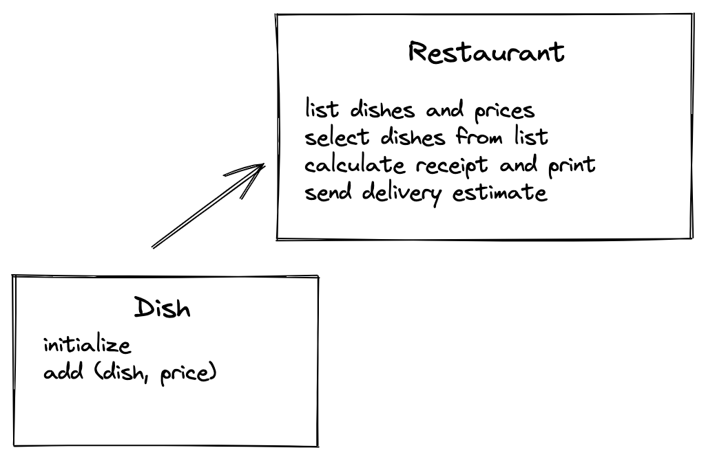

# {{PROBLEM}} Method Design Recipe

## 1. Describe the Problem

As a customer
So that I can check if I want to order something
I would like to see a list of dishes with prices.

As a customer
So that I can order the meal I want
I would like to be able to select some number of several available dishes.

As a customer
So that I can verify that my order is correct
I would like to see an itemised receipt with a grand total.

Use the twilio-ruby gem to implement this next one. You will need to use doubles too.

As a customer
So that I am reassured that my order will be delivered on time
I would like to receive a text such as "Thank you! Your order was placed and will be delivered before 18:52" after I have ordered.

## 2. Design the Method Signature

_Consider diagramming out the classes and their relationships. Take care to
focus on the details you see as important, not everything. The diagram below
uses asciiflow.com but you could also use excalidraw.com, draw.io, or miro.com_



```ruby
# EXAMPLE

class Dish
  def initialize(dish, price)
  end
  
  def dish
  # returns dish
  end

  def price
  # returns price
  end
end

class Restaurant
  def initialize # array for dishes, array for selected dishes
  end

  def add(dish)
   # add an instance from Dish class
  end

  def dishes
  # lists all dishes and their prices
  end

  def select_dishes(dish_choice)
  # allows user to select dishes from list and add to new array
  end

  def calculate_receipt
  # calculates cost from array of selected dishes and prints receipt
  end

  def delivery_estimate
  # outputs confirmation message with estimated delivery time
  end
end
```

# 3. Create Examples as Integration Tests

_Create examples of the classes being used together in different situations and
combinations that reflect the ways in which the system will be used._

```ruby
# adds an instance from Dish class and returns it
order = Restaurant.new
first_dish = Dish.new("Fish and Chips", "£7.99")
order.add(first_dish)
order.dishes # -> "Fish and Chips", "£7.99"

# adds multiple instances from Dish class and lists them
order = Restaurant.new
first_dish = Dish.new("Fish and Chips", "£7.99")
second_dish = Dish.new("Bangers and Mash", "£9.99")
order.add(first_dish)
order.add(second_dish)
order.dishes # -> [first_dish, second_dish]

# allows user to select dishes from list 
order = Restaurant.new
first_dish = Dish.new("Fish and Chips", "£7.99")
second_dish = Dish.new("Bangers and Mash", "£9.99")
third_dish = Dish.new("Waldorf Salad", "£6.99")
order.add(first_dish)
order.add(second_dish)
order.add(third_dish)
order.select_dishes(first_dish) # -> [first_dish]

# calculates cost of selected dishes
order = Restaurant.new
first_dish = Dish.new("Fish and Chips", "£7.99")
second_dish = Dish.new("Bangers and Mash", "£9.99")
third_dish = Dish.new("Waldorf Salad", "£6.99")
order.add(first_dish)
order.add(second_dish)
order.add(third_dish)
order.select_dishes(first_dish)
order.calculate_receipt # -> "£7.99"

# Write test for delivery_estimate
```

## 4. Create Examples as Unit Tests

_Create examples, where appropriate, of the behaviour of each relevant class at
a more granular level of detail._

```ruby
# Returns name of dish
new_dish = Dish.new("Fish and Chips", "£7.99")
new_dish.dish # => "Fish and Chips"

# Returns price of dish
new_dish = Dish.new("Fish and Chips", "£7.99")
new_dish.price # => "£7.99"
```

_Encode each example as a test. You can add to the above list as you go._

## 5. Implement the Behaviour

_After each test you write, follow the test-driving process of red, green,
refactor to implement the behaviour._